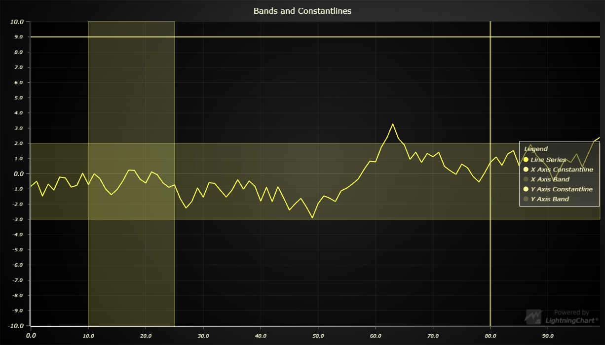

# JavaScript Chart Bands and Constant lines



This demo application belongs to the set of examples for LightningChart JS, data visualization library for JavaScript.

LightningChart JS is entirely GPU accelerated and performance optimized charting library for presenting massive amounts of data. It offers an easy way of creating sophisticated and interactive charts and adding them to your website or web application.

The demo can be used as an example or a seed project. Local execution requires the following steps:

- Make sure that relevant version of [Node.js](https://nodejs.org/en/download/) is installed
- Open the project folder in a terminal:

        npm install              # fetches dependencies
        npm start                # builds an application and starts the development server

- The application is available at *http://localhost:8080* in your browser, webpack-dev-server provides hot reload functionality.


## Description

Also known as Highlighters.

This example shows the basic usage of Bands and Constantlines in a XY Chart.

Bands and Constantlines are attached to the Axes of a XY Chart.
Bands and Constantlines can be interacted with mouse and touch controls.

Depending where you touch on the band, you can move either end of the Band separately by touching the edge of the Band, or you can move the entire Band by touching the center of the Band.

They can be easily added to an Axis:

```javascript
// Add a Constantline to an Axis
const constantline = axis.addConstantLine()

//Add a Band to an Axis
const band = axis.addBand()

// By default, the Band and Constantline are placed above all Series in the Chart.
// They can also be placed below all Series by passing *true* as argument when creating one.
const constantLline = axis.addConstantLine(false)

const band = axis.addBand(false)
```

## Positioning

The position of a Constantline can be set using the *setValue()* API:

```javascript
// Set the position of a Constantline
constantline.setValue( 50 )
```

The position and size of a Band is set by using the *setValueStart()* and *setValueEnd()* API:

```javascript
// Set the start value of a Band
band.setValueStart( 20 )
// Set the end value of a Band
band.setValueEnd( 40 )
```

## Styling

Constantlines can be styled by using the *setStrokeStyle()* API:

```javascript
// Style the Constantline
constantline.setStrokeStyle(
    new SolidLine({
        thickness: 5
        fillStyle: new SolidFill({
            color: ColorHEX('#fff')
        })
    })
)
```

Bands can be styled by using the *setStrokeStyle()* and *setFillStyle()* API accordingly:

```javascript
// Style the Band border
band.setStrokeStyle(
    new SolidLine({
        thickness: 5
        fillStyle: new SolidFill({
            color: ColorHEX('#fff')
        })
    })
)
// Style the Band's fillStyle
band.setFillStyle(
    new SolidFill({
        color: ColorHEX('#fff')
    })
)
```


## API Links

* [XY cartesian chart]
* [Line series]
* [HEX color factory]
* [Bands]
* [ConstantLines]


## Support

If you notice an error in the example code, please open an issue on [GitHub][0] repository of the entire example.

Official [API documentation][1] can be found on [Arction][2] website.

If the docs and other materials do not solve your problem as well as implementation help is needed, ask on [StackOverflow][3] (tagged lightningchart).

If you think you found a bug in the LightningChart JavaScript library, please contact support@arction.com.

Direct developer email support can be purchased through a [Support Plan][4] or by contacting sales@arction.com.

[0]: https://github.com/Arction/
[1]: https://www.arction.com/lightningchart-js-api-documentation/
[2]: https://www.arction.com
[3]: https://stackoverflow.com/questions/tagged/lightningchart
[4]: https://www.arction.com/support-services/

© Arction Ltd 2009-2020. All rights reserved.


[XY cartesian chart]: https://www.arction.com/lightningchart-js-api-documentation/v3.1.0/classes/chartxy.html
[Line series]: https://www.arction.com/lightningchart-js-api-documentation/v3.1.0/classes/lineseries.html
[HEX color factory]: https://www.arction.com/lightningchart-js-api-documentation/v3.1.0/globals.html#colorhex
[Bands]: https://www.arction.com/lightningchart-js-api-documentation/v3.1.0/classes/band.html
[ConstantLines]: https://www.arction.com/lightningchart-js-api-documentation/v3.1.0/classes/constantline.html

